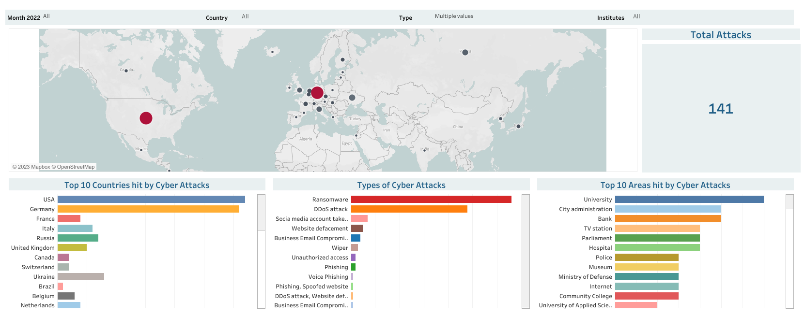

# Cyber Attacks 2022 Visualization

The purpose of this small project is to visualize cyber attacks in 2022 based upon country, type and area of fields all around the globe.\
In recent times I came across lot of news about cyber attacks (including our hostel whose server was hacked for several months halting all the payment and email system) in Germany so I thought to create a visualisation based on some data. Thanks to Bert Kondruss for collecting and providing publically available data at his website [here](https://konbriefing.com/en-topics/cyber-attacks-2022.html).

## Data Cleaning
 I started this project with the aim of using web scraping technique to acquire data but then I found out this pandas html method to directly grab the table. df = pd.read_html(url)[0]

The problem that I faced while reading this data was with null values. So I had to drop some of the entries from country column and then also replace some in state.

dropping rows where country is empty df = df.dropna(subset=['country'])

There is also another special method where you can fill the values of previous column to the next one if its value is empty. it was the case of city and state (some city and state names are same). If you remove axis = 1 it will be true for rows. df.fillna(method='ffill', axis = 1)

One other major problem I faced, despit there are no missing values but the data entry of Date column is not having all information. There were some records in date column, which are missing with either month or year information. So we can fillforward date columns because of a specific order, to make it more helpful for further analysis.

### Data Visualization
After making the dashboard I came to see that USA is the country with most cyber attacks followed by Germany on the second and France on the third place. Similarly, from available inforamtion on cities, Roma ranks where the most cyber attacks have happened amounting to 22 attacks. London second the list followed by Moscow and New York.
 

Click [here](https://public.tableau.com/app/profile/usama.zafar.qureshi/viz/CyberAttack2022/Dashboard#1) for tableau dashboard.